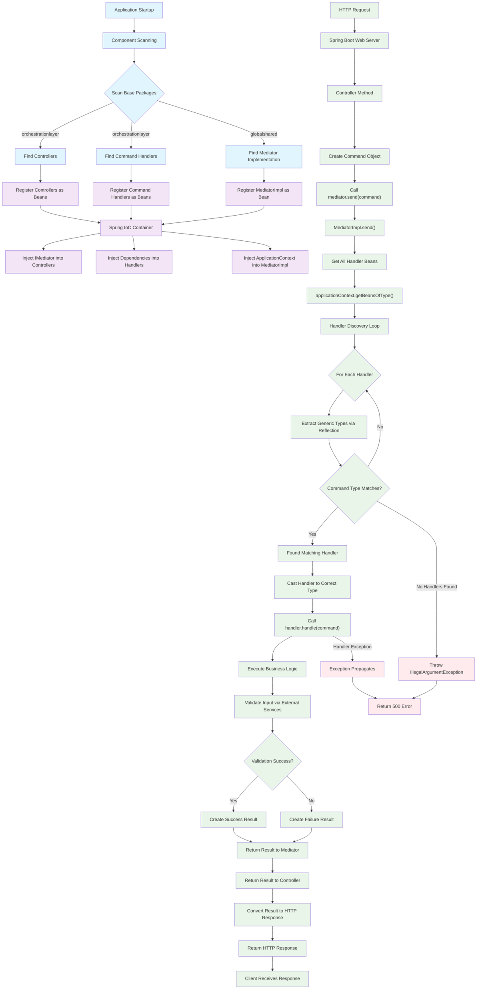
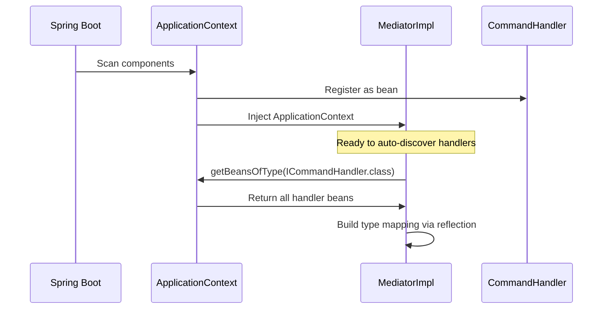
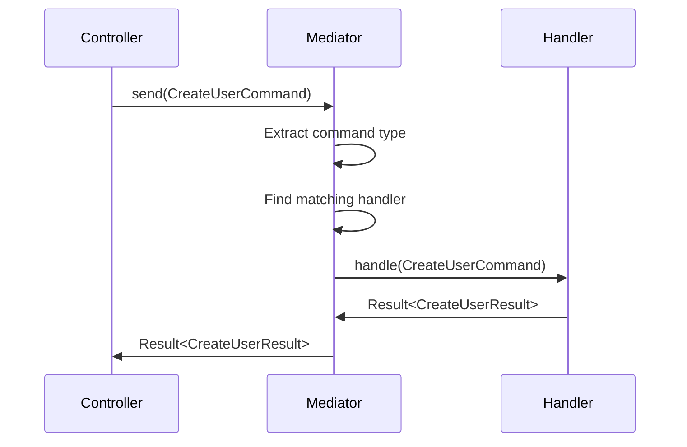

# Mediator Flow Diagram

This diagram illustrates the complete workflow of the mediator pattern implementation, from Spring Boot's auto-registration mechanism to the full request-response lifecycle.

## Complete Mediator Flow

## Detailed Flow Explanation

### 1. Spring Boot Startup Phase (Blue)
- **Component Scanning**: Spring Boot scans specified base packages
- **Bean Discovery**: Finds all `@Component`, `@Service`, `@Controller` annotated classes
- **Auto-Configuration**: Discovers mediator implementation and command handlers

### 2. Auto-Registration Phase (Purple)
- **Bean Registration**: Spring registers all discovered components in IoC container
- **Dependency Graph**: Builds dependency injection graph
- **Singleton Management**: Creates singleton instances of all beans

### 3. Runtime Request Phase (Green)
- **HTTP Request**: User sends request to REST endpoint
- **Controller Processing**: Spring routes request to appropriate controller method
- **Command Creation**: Controller creates command object with request data
- **Mediator Invocation**: Controller calls `mediator.send(command)`

### 4. Handler Discovery and Routing
- **Bean Retrieval**: `applicationContext.getBeansOfType(ICommandHandler.class)`
- **Type Extraction**: Uses reflection to extract generic type information
- **Handler Matching**: Finds handler that can process the specific command type
- **Type Safety**: Ensures compile-time type safety with runtime verification

### 5. Command Execution
- **Business Logic**: Handler executes domain-specific logic
- **External Services**: May call validation services or other dependencies
- **Result Creation**: Returns standardized `Result<T>` object

### 6. Response Generation
- **Result Processing**: Controller receives result from mediator
- **HTTP Mapping**: Converts result to appropriate HTTP status and body
- **Client Response**: Returns structured response to client

## Key Design Benefits

### Auto-Registration Magic

### Type-Safe Command Routing

## Error Handling Scenarios

### No Handler Found
- **Trigger**: Command sent without corresponding handler
- **Response**: `IllegalArgumentException` with descriptive message
- **HTTP Result**: 500 Internal Server Error

### Handler Exception
- **Trigger**: Handler throws runtime exception
- **Response**: Exception propagates to controller
- **HTTP Result**: Depends on exception type and global exception handler

### Validation Failure
- **Trigger**: Business validation fails in handler
- **Response**: `Result.failure()` with error message
- **HTTP Result**: 400 Bad Request or appropriate business error code

## Performance Characteristics

- **Handler Discovery**: One-time cost during first request (cached afterward)
- **Type Resolution**: Reflection overhead minimal due to caching
- **Spring Benefits**: Leverages Spring's optimized bean management
- **Memory Efficiency**: Singleton pattern ensures single instance per handler type

## Integration Points

1. **Spring Security**: Can be applied at controller level
2. **Spring AOP**: Cross-cutting concerns like logging, validation
3. **Spring Profiles**: Environment-specific handler implementations
4. **Spring Boot Actuator**: Health checks and metrics
5. **Spring Data**: Database operations within handlers